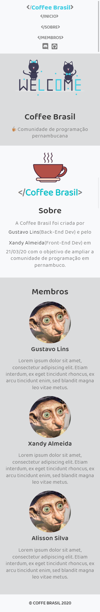

<h1 align="center">
    Coffee Labs
</h1>

---

<blockquote align="center">
	Website created to Coffee Labs
</blockquote>

# Instalação

1. `npm install`
2. Para rodar em produção, use `npm run build`
3. Para iniciar o DevServer com HOT Reload, use `npm run start`

# Install

1. `npm install`
2. To generate the assets for production, run `npm run build`
3. To start the DevServer with HOT Reload, use `npm run start`

<h1 align="center">
  Desktop
  
</h1>
<h1 align="center">
  Mobile
</h1>
<h1 align="center">
  
</h1>
